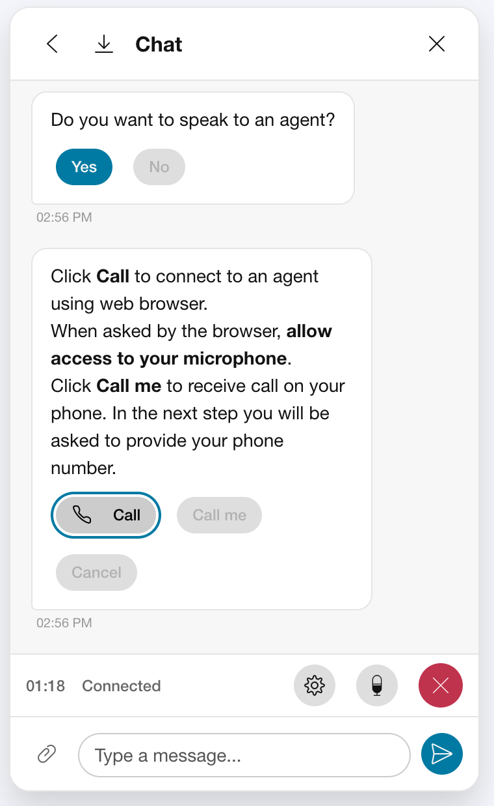

<table><tr>
<td valign="top">

# Webex Connect Chat Widget

A custom web component for embedding Webex App (IMI) chat functionality.

</td>
<td align="right" valign="top" width="340">

</td>
</tr></table>

## Configuration

The widget is configured via HTML attributes on the `<chat-widget>` tag.

### Critical Parameters

| Attribute | Description | Required | Source |
|-----------|-------------|----------|--------|
| `app-id` | Your Webex App ID | Yes | Webex Connect |
| `client-key`        | `YOUR_CLIENT_KEY`    | **Required**. The secret key for authentication. |
| `site-url`             | `YOUR_SITE_URL`      | **Required**. Your Webex Connect Site URL (e.g. `https://ccbootcamsandbox...webexconnect.io`). The derived API and MQTT URLs are used automatically. |
| `website-domain`       | `YOUR_DOMAIN`        | **Required**. The "Website Domain" configured in your Web Chat Asset (e.g. `kp.cz`, `example.com`). |
| `widget-id` OR `data-bind` | The Widget ID (UUID) | **Yes** (for uploads) | **Webex Control Hub** (See below) |

### Obtaining the Widget ID (`data-bind`)

To enable file uploads, you must provide the `widget-id` (also known as `data-bind`). 

1.  Go to **Webex Control Hub**.
2.  Navigate to **Web Chat Assets**.
3.  In the "Installation" section, find the **Embed Code**.
4.  Look for the `data-bind` attribute in the snippet: `data-bind="GUID"`.
5.  Use this GUID as the `widget-id` or `data-bind` attribute on this widget.

For more details, refer to the [Webex Documentation: Set up Web Chat](https://help.webex.com/article/fgab23).

### Optional Parameters

| Attribute | Description | Default |
|-----------|-------------|---------|
| `start-message` | A message to send automatically when the chat starts. | None |
| `start-message-hidden` | If `true`, the start message is hidden from the user interface. | `false` |
| `custom-profile-params`| `YOUR_CUSTOM_PARAMS` | Custom profile parameters string for user context. |

## Example Usage

```html
<chat-widget
  app-id="AI00000000"
  client-key="your-client-key"
  site-url="https://ccbootcampsandbox.us.webexconnect.io"
  website-domain="example.com"
  widget-id="00000000-0000-0000-0000-000000000000"
  start-message-hidden="true"
></chat-widget>
<script type="module" src="./src/main.js"></script>
```

## Deployment

1.  **Build**: Run `npm run build` to generate the `dist/` folder.
2.  **Host**: Upload the contents of `dist/` to your web server (e.g., `https://kp.cz/chat/`).
3.  **Embed**:
    *   Include the JS and CSS files from the build in your website's main HTML.
    *   Add the `<chat-widget>` tag with your configuration.
4.  **CORS Requirement**: 
    *   Ensure your `website-domain` (e.g., `kp.cz`) matches the domain where you are hosting this widget.
    *   Webex Connect uses this domain to whitelist your requests (CORS).

## Autostart Message

The widget can automatically start a conversation and send an initial message as soon as it loads — without any user interaction. This is useful for proactive engagement flows.

### Configuration

| Attribute | Description |
|-----------|-------------|
| `start-message` | The text to send automatically when the widget first loads and no prior conversation exists. |
| `start-message-hidden` | If `true`, the autostart message is **not shown** in the chat UI (invisible to the customer). |

```html
<chat-widget
  app-id="AI00000000"
  client-key="your-client-key"
  site-url="https://example.us.webexconnect.io"
  website-domain="example.com"
  widget-id="00000000-0000-0000-0000-000000000000"
  start-message="electricity"
  start-message-hidden="true"
></chat-widget>
```

### Behaviour
- The autostart fires only when there are **no existing threads** for this user (i.e. first visit).
- On reload, existing threads are restored from the server — the autostart is **skipped** to avoid duplicates.
- The message text is saved in `sessionStorage` as a fallback if the attribute is lost during re-renders.
- When `start-message-hidden="true"`, the message is sent with `extras.hiddenStart = true` so the Webex Connect flow can identify it as a system trigger and suppress it in any customer-facing transcript.

### Combining with Context Params

Context parameters are merged into the `extras` of the autostart message, so the flow receives them on the very first event:

```html
<chat-widget
  ...
  start-message="electricity"
  start-message-hidden="true"
  context-params='{"topic":"electricity","campaignToken":"SUMMER2025"}'
></chat-widget>
```

---

## Passing Extras / Context to the Backend

Every message sent by the widget carries an `extras` object that is forwarded to the Webex Connect flow. You can inject arbitrary key-value pairs into `extras` to pass customer or session context to the backend — without exposing PII in the message text.

### Method 1 — HTML Attribute (`context-params`)

Pass a JSON string as the `context-params` attribute. These are applied at widget initialisation and carried on every message.

```html
<chat-widget
  ...
  context-params='{"campaignToken":"CAMP-2025-Q1","customerToken":"abc123","source":"web"}'
></chat-widget>
```

### Method 2 — JavaScript API (`setContext()`)

Call `setContext()` on the widget element from your host page at any time (before or after the widget opens). This replaces the previous context entirely.

```javascript
const widget = document.querySelector('chat-widget');

// Set context after the user logs in or selects a topic
widget.setContext({
  campaignToken: 'CAMP-2025-Q1',
  customerToken: 'abc123',
  topic: 'electricity'
});
```

> **Note:** Call `setContext()` before the customer sends their first message, or before `start-message` fires, to ensure the context is included from the very first event.

### What the Webex Connect Flow Receives

The context parameters are merged into the `extras` object of every outgoing message alongside built-in fields:

```json
{
  "extras": {
    "Initiated from URL": "https://example.com/webchat?campaignToken=SUMMER2025&customerToken=abc123",
    "Website": "example.com",
    "Browser language": "cs-CZ",
    "campaignToken": "CAMP-2025-Q1",
    "customerToken": "abc123",
    "topic": "electricity"
  }
}
```

In a Webex Connect flow, access them via:
- `$(n1.extras.campaignToken)` 
- `$(n1.extras.customerToken)` 
- `$(n1.extras.topic)` 

(where `n1` is the inbound message node)

### Built-in Extras Fields

These are always included automatically:

| Field | Description |
|-------|-------------|
| `Initiated from URL` | The page URL where the widget was loaded |
| `Website` | The `website-domain` attribute value |
| `Browser language` | `navigator.language` (e.g. `cs-CZ`) |
| `browser_languages` | All `navigator.languages` comma-separated |
| `useragent` | Full user agent string |
| `Website` | The `website-domain` attribute value |
| `customprofileparams` | The `custom-profile-params` attribute value |

---

## Webex Calling Integration


This widget supports in-browser voice calls using the [Webex Calling SDK](https://developer.webex.com/webex-calling/docs/sdk). There are two authentication approaches; **Guest Calling is strongly preferred** for web widget deployments as it requires no end-user login or a dedicated user-based license.

---

### Option 1 — Guest Calling (Preferred)

Guest Calling uses the [Webex Guest Issuer API](https://developer.webex.com/docs/guest-issuer) to generate short-lived JWT tokens for anonymous web users. No Webex account is required by the customer.

#### Why Guest Calling?
- No end-user login required — tokens are issued server-side and injected at runtime
- Tokens are short-lived and scoped to a single call
- Ideal for customer-facing web chat widgets

#### Documentation References
- [Guest Issuer overview](https://developer.webex.com/create/docs/sa-guest-management)
- [Guest Calling API](https://developer.webex.com/calling/docs/api/v1/beta-click-to-call)
- [Webex Calling for Developers](https://developer.webex.com/calling/docs/webex-calling-overview)
- [Webex Calling SDK](https://developer.webex.com/webex-calling/docs/sdk)
- [Webex Calling SDK Kitchensink App](https://web-sdk.webex.com/samples/calling/)
- [Customer Assist in Control Hub](https://help.webex.com/article/n0fy4kb)

---

#### Setup Flow

##### 1. Licenses — Control Hub
Ensure the org has the appropriate licenses:
- **Customer Assist** must be provisioned
- Navigate to **Control Hub → Account → Subscriptions** and verify Customer Assist is active
- For Webex CC integration, the queue extension number must be reachable from the Customer Assist dial plan

##### 2. Create a Service App — Developer Portal
1. Go to [developer.webex.com → My Webex Apps](https://developer.webex.com/my-apps)
2. Click **Create a New App → Service App**
3. Provide a name and description
4. Add the required OAuth scopes:
   ```
   spark:webrtc_calling
   guest-issuer:read
   guest-issuer:write
   ```
5. Submit for review / save the **Client ID** and **Client Secret**

> Refer to [Service App documentation](https://developer.webex.com/create/docs/sa-guest-management) for full instructions.

##### 3. Authorize the Service App — Control Hub
1. In **Control Hub → Apps → Service Apps**
2. Find your Service App and click **Authorize**
3. Select the org and confirm scopes

##### 4. Issue Service App Access & Refresh Tokens — Developer Portal
1. In the Developer Portal, navigate to your Service App
2. Use the **OAuth 2.0 Client Secret** to obtain initial `access_token` and `refresh_token` for the authorized Webex Org (drop-down list).
3. **Save both tokens securely** — the access token is short-lived; use the refresh token to renew it server-side using the [Refresh Token Method](https://developer.webex.com/create/docs/integrations#using-the-refresh-token). Before using the access token, you can check its expiration using [Get Expiration Status for a Token API](https://developer.webex.com/admin/docs/api/v1/authorizations/get-expiration-status-for-a-token).

##### 5. Create a Customer Assist Queue & Number
1. In **Control Hub → Services → Customer Assist**
2. Create a new **Queue**
3. Select a **Location**. This parameter is important for caller identification. As the guest user has no line assigned, the **Main number of the location** is used as the caller id. The real caller identity needs to be handled out of band, for example using [Cisco Journey Data Service](https://developer.webex.com/webex-contact-center/docs/api/v1/data-ingestion/journey-event-posting). See the Quick Reply Button postback Payload below.
4. Assign an **extension** (no PSTN number required for web-only calls)
5. This extension is the `destination` in the call payload and `calledNumber` in the guest call token generation API payload.

##### 6. Add the Customer Assist Number to Click-to-call
This step is important, it tells the guest call token API which numbers are allowed for call token generation. Only **Customer Assist Queues and Attendant Numbers can be added to click-to-call.
1. In **Control Hub → Services → Calling → Settings** find section **Click-to-call**
2. Make sure click-to-call is enabled and click **Preferences**
3. In **Add destination number** dropdown find the previously created Customer Assist Queue and select it.
4. Check that the Queue and Number are now in the members list.
5. Click **Save**.

##### 7. Webex Contact Center Integration (Optional)
To route calls from Customer Assist to Webex CC:
1. On the Customer Assist queue number, configure **Call Forwarding** to the Webex CC endpoint
2. The Webex CC endpoint can be an internal extension — no PSTN number allocation needed
3. This allows the web visitor to initiate a voice call that is routed directly into a Webex CC queue/agent

---
#### Standalone Testing
Use the [Kitchensink App](https://web-sdk.webex.com/samples/calling/) to test the Guest Calling functionality. You can use Webex Developer Portal to generate guest and call tokens for and then use them in the Kitchensink App to test the Guest Calling functionality. Follow these steps in the Kitchensink App:
1. in **Advanced Settings** click on **Choose Service** and selct **guest calling**. Leave the Service Domain blank.
2. when calling Webex Guest APIs in the next steps, use **Service App Access Token** for authorization (paste manually into the field next to **Bearer**).
3. generate **Guest Identity** using [Guest Issuer API](https://developer.webex.com/admin/docs/api/v1/guest-management/create-a-guest) and paste its Access Token (the Guest Token) to the **Access Token** field in the Kitchensink App.
4. generate **Call Token** using [Guest Click-to-call API](https://developer.webex.com/calling/docs/api/v1/beta-click-to-call/create-a-call-token) and paste the token to the **JWT token for destination** field in the Kitchensink App.
5. click on **Initialize Calling** button.
6. click on **getMediaStreams()** button to activate microphone and speaker. You may see a browser popup asking for microphone and speaker permissions. Grant them.
7. click on **Make Call** button. There is no need to enter destination as it's embedded in the **Call Token**. The call should establish.

#### QR Message Format — Guest Calling

The Webex Connect flow injects a Guest Token and Call Token (issued server-side for the specific session) into the Quick Reply payload. The widget renders a **Call** Quick Reply button from this payload.

```json
{
  "type": "guestcall",
  "destination": "1001",
  "guestToken": "<GUEST_TOKEN>",
  "callToken": "<CALL_TOKEN>"
}
```

| Field | Description |
|-------|-------------|
| `type` | Must be `"guestcall"` |
| `destination` | Extension of the Customer Assist queue (e.g. `1001`) |
| `guestToken` | Short-lived Guest AccessToken, generated server-side via Guest Issuer API and passed through the flow |
| `callToken` | Short-lived Call AccessToken, generated server-side via Guest Click-to-call API and passed through the flow |

In order to provide information about the caller, the button click generates this seqence of actions:
1. Initialize Webex Calling SDK with the tokens.
2. Initialize media streams (microphone and speaker).
3. Make a call (remember that destination is embedded in the call token and doesn't need to be specified).
4. Once the call is proceeding, get the callId from the SDK and send it in the QR postback Payload. The payload looks like:
```json
{
  "type":"guestcall",
  "callId":"e9885e1a-d03f-4ed4-b026-ef46a5314adb",
  "status":"dialing"
}
```
The **callId** is delivered in headers of the incoming call to the Webex CC Channel (endpoint). For example:
```json
{
  "session-id":"e9885e1ad03f4ed4b026ef46a5314adb;remote=00000000000000000000000000000000",
  "x-cisco-location-info":"d939ee57-96c2-4e65-acb4-80f989698f68;country=DE;local",
  "caller_id_name":"Jarda Martan (Guest)"
}
```
**session-id** is not the exact copy of the **callId**, but it's not difficult to extract the information and match the two. When we store the callId from the postback payload (for example in JDS), we can use it to identify the caller in the Webex CC Channel.

**Flow to generate the Guest Token and Call Token server-side:**
1. The Webex Connect flow triggers a webhook / function node
2. The backend calls `POST /guests/token` with the Service App Access Token and a guest user object. The guest user object should look like:
```json
{
  "subject": "<GUEST_ID>",
  "displayName": "<GUEST_NAME>"
}
```
The GUEST_ID can be anything, but it must be unique for each guest. It can be for example derived from an email address or from internal customer ID. It may be beneficial to use the same GUEST_ID for the all customer's sessions as the communication history is kept for each GUEST_ID. Note that the GUEST_ID cannot contain **@ . -** characters. It can contain only alphanumeric characters and underscores. 
3. The returned access token is injected into the Quick Reply payload as `guestToken`
4. The backend calls `POST /telephony/click2call/callToken` with the Service App Access Token and a guest calling object:
```json
{
    "calledNumber": "1001",
    "guestName": "<GUEST_NAME>"
}
```
5. The returned call token is injected into the Quick Reply payload as `callToken`

---

### Option 2 — Standard Webex Calling (Named User)

For deployments where the end user has a Webex Calling account, the access token can be passed directly. This is less suitable for anonymous web chat but supported for intranet/employee-facing deployments.

#### QR Message Format — Standard Calling

```json
{
  "type": "webexcall",
  "destination": "+1234567890",
  "accessToken": "<NAMED_USER_ACCESS_TOKEN>"
}
```

> **Legacy fallback:** `description: "make a call using webex calling"` is also supported for backward compatibility.

---

### Call UI Features
- **Audio Settings**: Floating panel to select Microphone and Speaker devices. Activate/deactivate background noise removal (BNR).
- **Call Controls**: Mute, Hang-up, and Timer controls integrated into the chat footer
- **Persistence**: Active calls remain connected even if the chat widget is minimized
